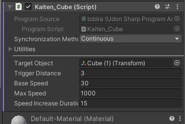

---
targetObject: 回転させるオブジェクト
triggerDistancef:反応する距離
baseSpeed:基本の回転速度
maxSpeed:最大回転速度
speedIncreaseDuration:何秒で最大速度に到達するか
---

このスクリプトを適当なオブジェクトにアタッチしてください。
オブジェクトをOFFにすると動作しません。必要に応じてHierarchyからGameCubeを作成し、そこにアタッチしてください

上記の値は適当にデフォルトになってるので状況に合わせて変更してください
targetObjectの箇所に動かしたいオブジェクトをD＆Dしてください

    